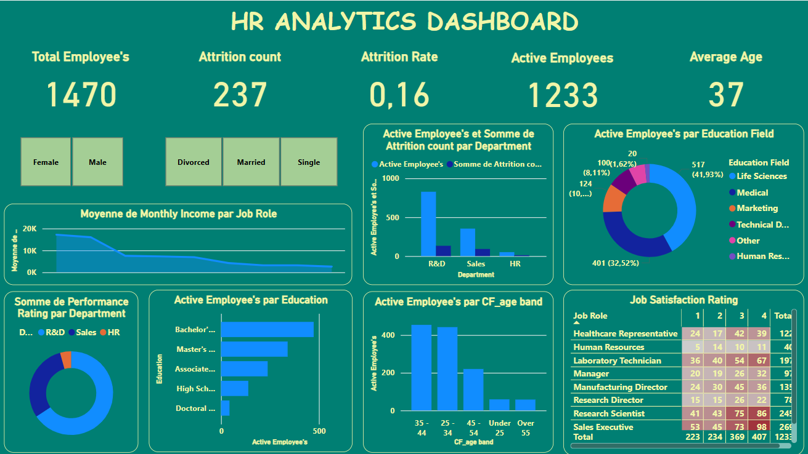

# 🧑‍💼 HR Analytics Dashboard

An interactive Power BI dashboard designed to analyze HR data, monitor attrition rates, and understand employee distribution and satisfaction across various departments and roles. This dashboard is an essential tool for HR professionals to gain valuable insights into employee performance, retention, and satisfaction.

## 🚀 Project Overview

This project involves a Power BI dashboard built to provide real-time insights into HR performance metrics. Key areas of analysis include employee attrition, job satisfaction, and employee demographics across departments and positions. The dashboard allows for easy exploration of various HR metrics, including the breakdown of attrition rates by department and demographic factors.

### Key Features:
- **HR Performance Monitoring**: Track key HR metrics in real-time.
- **Attrition Analysis**: Analyze employee attrition by department, role, and demographic factors.
- **Job Satisfaction Breakdown**: Visualize employee satisfaction across different departments and job roles.
- **Demographic Insights**: Interactive analysis of employee data by gender, age, marital status, and education.

## 🛠️ Technologies Used

- **Power BI**: Interactive dashboard creation
- **DAX**: Data analysis and custom metrics calculation
- **Excel**: Data preprocessing and manipulation
- **Data Modeling**: Data model creation to structure the HR data for analysis

